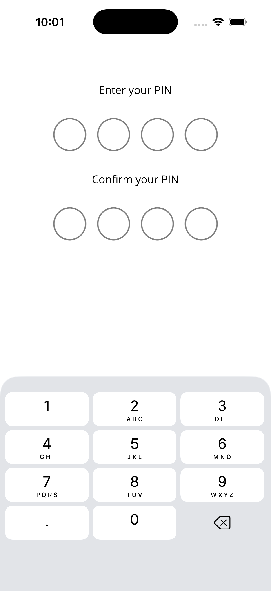
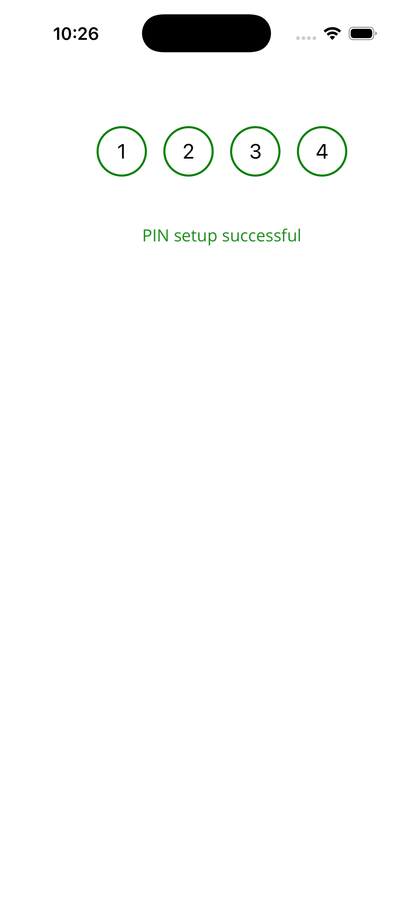

# KKPinView for .NET MAUI

A secure PIN entry and management library for .NET MAUI applications. Provides PIN setup, authentication, secure storage with AES-256 encryption, and lockout protection.

## Features

- 🔒 **Secure Storage**: AES-256 encryption with device-specific keys
- 🔐 **PIN Authentication**: Easy-to-use PIN entry views
- 🛡️ **Lockout Protection**: Configurable attempt limits and lockout duration
- 🎨 **Customizable UI**: Fully customizable colors, fonts, and dimensions
- 📱 **Cross-Platform**: Supports Android, iOS, and Windows
- ✨ **Modern UI**: Beautiful, native-looking PIN entry interface
- ⌨️ **Dual Input Methods**: Support for both numeric keypad and system keyboard
- 🎯 **Visual Feedback**: Red border indicators for invalid PIN entries
- 📏 **Dynamic Layout**: Auto-adjusting error message heights based on content
- 🔄 **Dynamic View Switching**: Automatically shows setup or entry view based on PIN status

## Installation

Install the package from NuGet:

```bash
dotnet add package KKPinView
```

Or via Package Manager:

```
Install-Package KKPinView
```

## Screenshots

<!-- Add your screenshots here -->
<!-- 




-->

> **Note**: Screenshots will be added here. Please add your screenshots to the `screenshots/` folder and update the paths above.

### Visual Features

- **Invalid PIN Indicator**: All PIN fields display red borders when an invalid PIN is entered
- **Dynamic Error Messages**: Error message height automatically adjusts based on message length
- **Smooth Animations**: Fade and scale animations for error/success messages
- **Auto-focus Management**: Automatic focus movement between fields when using system keyboard

## Quick Start

### Simple Integration Example

The simplest way to integrate KKPinView is to check if a PIN exists and show the appropriate view:

```csharp
using KKPinView.Storage;
using KKPinView.Views;

public partial class MainPage : ContentPage
{
    private KKPINSetUPView? _setupView;
    private KKPinViews? _pinView;

    public MainPage()
    {
        InitializeComponent();
        LoadPinView();
    }

    private void LoadPinView()
    {
        // Check if PIN exists in storage
        bool hasPin = KKPinStorage.HasStoredPIN();

        if (hasPin)
        {
            // PIN exists - show PIN entry view
            ShowPinEntryView();
        }
        else
        {
            // No PIN stored - show PIN setup view
            ShowPinSetupView();
        }
    }

    private void ShowPinSetupView()
    {
        // Clean up existing view
        PinContentView.Content = null;
        _pinView = null;

        // Create and show PIN setup view
        _setupView = new KKPINSetUPView();
        PinContentView.Content = _setupView;

        // Handle successful PIN setup - switch to PIN entry view
        _setupView.OnSetupSuccess = () =>
        {
            ShowPinEntryView();
        };

        // Handle PIN setup failure
        _setupView.OnSetupFailed = (errorMessage) =>
        {
            // Error is already displayed in the view
            System.Diagnostics.Debug.WriteLine($"PIN setup failed: {errorMessage}");
        };
    }

    private void ShowPinEntryView()
    {
        // Clean up existing view
        PinContentView.Content = null;
        _setupView = null;

        // Create and show PIN entry view
        _pinView = new KKPinViews();
        PinContentView.Content = _pinView;

        // Handle "Forgot PIN" - delete PIN and show setup view
        _pinView.OnForgotPin = () =>
        {
            KKPinStorage.DeletePIN();
            ShowPinSetupView();
        };

        // Handle PIN validation result
        _pinView.OnSubmit = (isValid) =>
        {
            if (isValid)
            {
                // PIN is valid - user is authenticated
                // Navigate to your authenticated page or show main content here
                System.Diagnostics.Debug.WriteLine("PIN validated successfully!");
            }
        };
    }
}
```

### 1. PIN Setup

Use `KKPINSetUPView` when the user needs to create a PIN:

```csharp
using KKPinView.Views;
using KKPinView.Storage;

var setupView = new KKPINSetUPView
{
    OnSetupSuccess = () =>
    {
        Console.WriteLine("PIN setup complete");
        // Navigate to authenticated screen
    },
    OnSetupFailed = (errorMessage) =>
    {
        Console.WriteLine($"PIN setup failed: {errorMessage}");
        // Error is already displayed in the view
    }
};

// Add to your ContentPage
PinContentView.Content = setupView;
```

### 2. PIN Entry (Authentication)

Use `KKPinViews` when the user needs to enter their PIN:

```csharp
using KKPinView.Views;
using KKPinView.Storage;

var pinView = new KKPinViews
{
    OnForgotPin = () =>
    {
        Console.WriteLine("Forgot PIN tapped");
        // Handle forgot PIN flow (e.g., delete PIN and show setup)
        KKPinStorage.DeletePIN();
    },
    OnSubmit = (isValid) =>
    {
        if (isValid)
        {
            Console.WriteLine("PIN is valid - access granted");
            // Navigate to authenticated screen
        }
        else
        {
            Console.WriteLine("PIN is invalid");
            // Error is automatically displayed with red borders
        }
    },
    ShowForgotPin = true
};

// Add to your ContentPage
PinContentView.Content = pinView;
```

## Input Methods

KKPinView supports two input methods that can be configured via `KKPinviewConstant.InputMethod`:

### SystemKeyboard
- Uses the system numeric keyboard
- PIN fields are editable
- Auto-focus moves between fields
- Best for keyboard-first experiences

```csharp
using KKPinView.Constants;

// Use system keyboard
KKPinviewConstant.InputMethod = PinInputMethod.SystemKeyboard;
```

## API Documentation

### KKPinViews

Main PIN entry view for authenticating users.

#### Properties

- `OnForgotPin`: Optional callback when "Forgot PIN?" is tapped
- `OnSubmit`: Callback with validation result (`true` if PIN is valid, `false` otherwise)
- `ShowForgotPin`: Whether to show the "Forgot PIN?" button (default: `true`)
- `BackgroundColor`: Background color of the view
- `TextColor`: Text color
- `ErrorTextColor`: Error message color
- `SuccessTextColor`: Success message color
- `TitleFontSize`: Title font size
- `SubtitleFontSize`: Subtitle font size
- `FieldSpacing`: Spacing between PIN fields

#### Behavior

- Automatically validates PIN when all digits are entered
- Displays error messages for invalid PINs with dynamic height based on message length
- Shows red borders on all PIN fields when PIN is invalid
- Handles lockout automatically (disables input when locked out)
- Clears PIN fields after validation
- Supports both numeric keypad and system keyboard input methods

---

### KKPINSetUPView

PIN setup view for creating a new PIN with confirmation.

#### Properties

- `OnSetupComplete`: Optional callback when PIN setup is completed successfully. Receives the PIN string.
- `BackgroundColor`: Background color of the view
- `TextColor`: Text color
- `ErrorTextColor`: Error message color
- `SuccessTextColor`: Success message color
- `TitleFontSize`: Title font size
- `SubtitleFontSize`: Subtitle font size
- `FieldSpacing`: Spacing between PIN fields

#### Behavior

- Two-step flow: Enter PIN → Confirm PIN
- Validates that both PINs match
- Automatically saves PIN when both match
- Clears previous PIN and lockout state before saving
- Displays success/error messages with animations

---

### KKPinStorage

High-level API for securely storing and retrieving PINs.

#### Methods

```csharp
// Save a PIN
bool SavePIN(string pin)

// Load stored PIN
string? LoadPIN()

// Verify a PIN
bool VerifyPIN(string pin)

// Check if PIN exists
bool HasStoredPIN()

// Delete stored PIN
void DeletePIN()
```

#### Example

```csharp
using KKPinView.Storage;

// Save PIN
if (KKPinStorage.SavePIN("1234"))
{
    Console.WriteLine("PIN saved successfully");
}

// Verify PIN
if (KKPinStorage.VerifyPIN("1234"))
{
    Console.WriteLine("PIN is correct");
}

// Check if PIN exists
if (KKPinStorage.HasStoredPIN())
{
    // Show PIN entry screen
}
else
{
    // Show PIN setup screen
}
```

---

### KKPinLockoutManager

Manages PIN validation attempts and lockout logic.

#### Properties

- `FailedAttempts`: Current number of failed attempts
- `MaxAttempts`: Maximum allowed attempts
- `IsLockedOut`: Whether currently locked out
- `RemainingLockoutMinutes`: Remaining lockout time
- `HasReachedMaxAttempts`: Whether max attempts reached

#### Methods

```csharp
// Validate PIN (handles attempt tracking)
bool ValidatePIN(string pin)

// Reset failed attempts
void ResetFailedAttempts()

// Check lockout status
void CheckLockoutStatus()

// Get error message
string? GetErrorMessage()
```

#### Example

```csharp
using KKPinView.Security;

var manager = new KKPinLockoutManager();

if (manager.IsLockedOut)
{
    Console.WriteLine($"Locked out for {manager.RemainingLockoutMinutes} minutes");
}

if (manager.ValidatePIN("1234"))
{
    Console.WriteLine("PIN is valid");
}
else
{
    if (manager.GetErrorMessage() is string error)
    {
        Console.WriteLine(error);
    }
}
```

## Customization

### Constants

Most UI elements can be customized via `KKPinviewConstant`:

```csharp
using KKPinView.Constants;

// PIN Configuration
KKPinviewConstant.TotalPinTextFields = 4;  // Change PIN length (default: 4)

// Lockout Configuration
KKPinviewConstant.MaxPinAttempts = 5;  // Default: 5
KKPinviewConstant.PinLockoutDurationMinutes = 5;  // Default: 5 minutes

// Colors
KKPinviewConstant.BackgroundColor = Colors.White;
KKPinviewConstant.TextColor = Colors.Black;
KKPinviewConstant.ErrorTextColor = Colors.Red;
KKPinviewConstant.SuccessTextColor = Colors.Green;
KKPinviewConstant.DigitFieldBackgroundColor = Colors.LightGray;
KKPinviewConstant.DigitFieldFilledColor = Colors.Blue;
KKPinviewConstant.InvalidPinBorderColor = Colors.Red;  // Border color when PIN is invalid

// Fonts
KKPinviewConstant.TitleFontSize = 24;
KKPinviewConstant.SubtitleFontSize = 16;
KKPinviewConstant.DigitFontSize = 20;
KKPinviewConstant.KeypadButtonFontSize = 24;

// Dimensions
KKPinviewConstant.FieldHeight = 60;
KKPinviewConstant.FieldWidth = 60;
KKPinviewConstant.FieldSpacing = 15;
KKPinviewConstant.KeypadButtonSize = 70;
KKPinviewConstant.KeypadSpacing = 10;

// Strings
KKPinviewConstant.TitleTextFormat = "Enter PIN";
KKPinviewConstant.SubtitleText = "Enter your {0}-digit PIN";
KKPinviewConstant.ForgotPinText = "Forgot PIN?";
KKPinviewConstant.SetupTitleText = "Setup PIN";
KKPinviewConstant.ConfirmPinTitleText = "Confirm PIN";
KKPinviewConstant.InvalidPinError = "Invalid PIN";
KKPinviewConstant.PinMismatchError = "PINs do not match";
KKPinviewConstant.LockedOutError = "Too many failed attempts. Please try again in {0} minutes";

// Input Method
KKPinviewConstant.InputMethod = PinInputMethod.NumericKeypad;  // or PinInputMethod.SystemKeyboard
```

## Security Features

### Encryption

- **Algorithm**: AES-256-CBC
- **Key Derivation**: SHA256 with device-specific salt
- **Key Storage**: Secure keychain/keyring storage with device binding

### File Protection

- **Protection Type**: Platform-specific secure storage
- **Access**: PINs are only accessible when device is unlocked
- **Storage Location**: Secure storage (Keychain on iOS, EncryptedSharedPreferences on Android)

### Lockout Protection

- **Default Max Attempts**: 5
- **Default Lockout Duration**: 5 minutes
- **Configurable**: Can be customized via `KKPinviewConstant` or `KKPinLockoutManager`

### Security Notes

- PINs are encrypted before storage
- Encryption keys are device-specific (cannot be transferred)
- Files are protected at the OS level
- Failed attempts are tracked and enforced
- Lockout state persists across app launches

## Architecture

```
KKPinView/
├── Views/
│   ├── KKPinViews.xaml/cs          # PIN entry view
│   ├── KKPINSetUPView.xaml/cs      # PIN setup view
│   ├── PinDigitField.xaml/cs       # Individual digit field
│   └── NumericKeypad.xaml/cs       # Custom keypad
├── Storage/
│   └── KKPinStorage.cs             # High-level storage API
├── Security/
│   └── KKPinLockoutManager.cs      # Lockout management
├── Constants/
│   └── KKPinviewConstant.cs        # Configuration constants
└── Platforms/
    ├── Android/
    │   └── KKEncryptionHelper.cs   # Android encryption
    └── iOS/
        └── KKEncryptionHelper.cs   # iOS encryption
```

## Requirements

- .NET 10.0 or later
- .NET MAUI
- Android API 21+ (Android 5.0+)
- iOS 15.0+
- Windows 10.0.19041.0+ (optional)

## License

This project is licensed under the MIT License - see the LICENSE file for details.

## Contributing

Contributions are welcome! Please feel free to submit a Pull Request.

## Support

For issues, questions, or feature requests, please open an issue on GitHub.

## Author

Created by kamalkumar

---

**Made with ❤️ using .NET MAUI**

